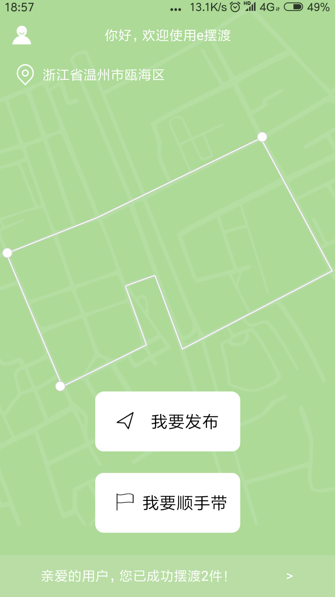
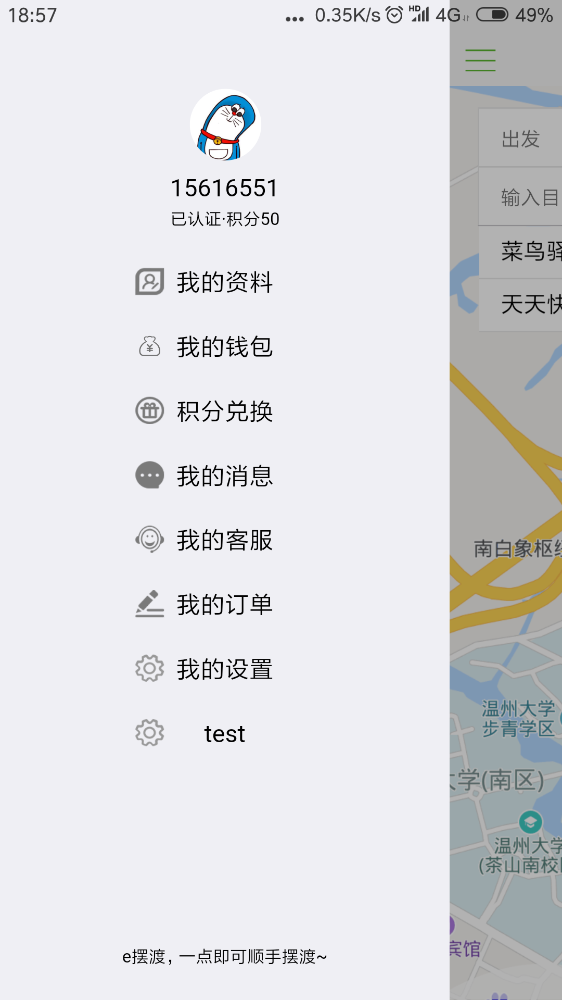
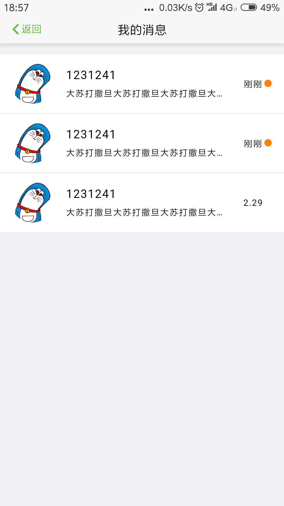
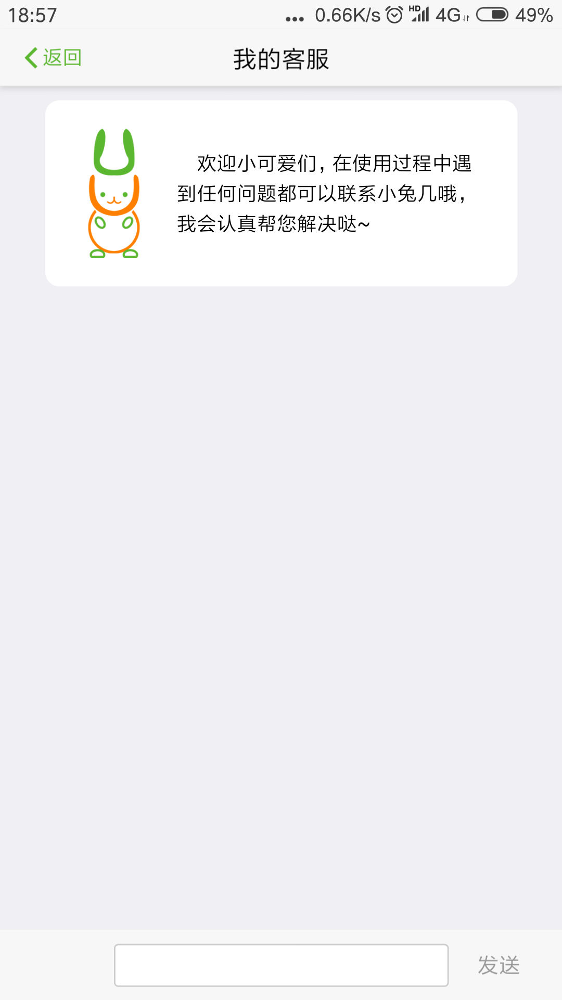

# e摆渡项目截图

---

---

---

---

---

---

---

---

---

# License
Copyright (c) 2018 WZVTC Pione Studio.

eBaidu is is a demo version we made based on an idea. ; you can redistribute it and/or modify it under the terms of the GNU General Public License as published by the Free Software Foundation; either version 2 of the License, or (at your option) any later version.

Copyright 2001 - 2018. A list of authors can be found here; authors of changes made in this repository are listed in the commit history.

Extensions and skins may be released under different licenses than MediaWiki itself. Most of them are usually distributed with a copy of their respective licenses and copyright notices.